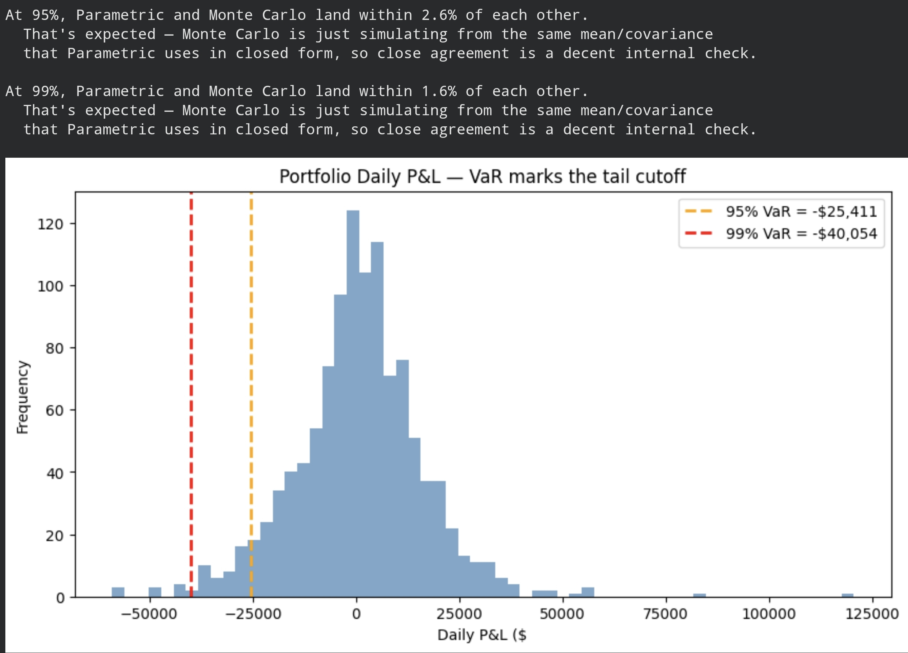
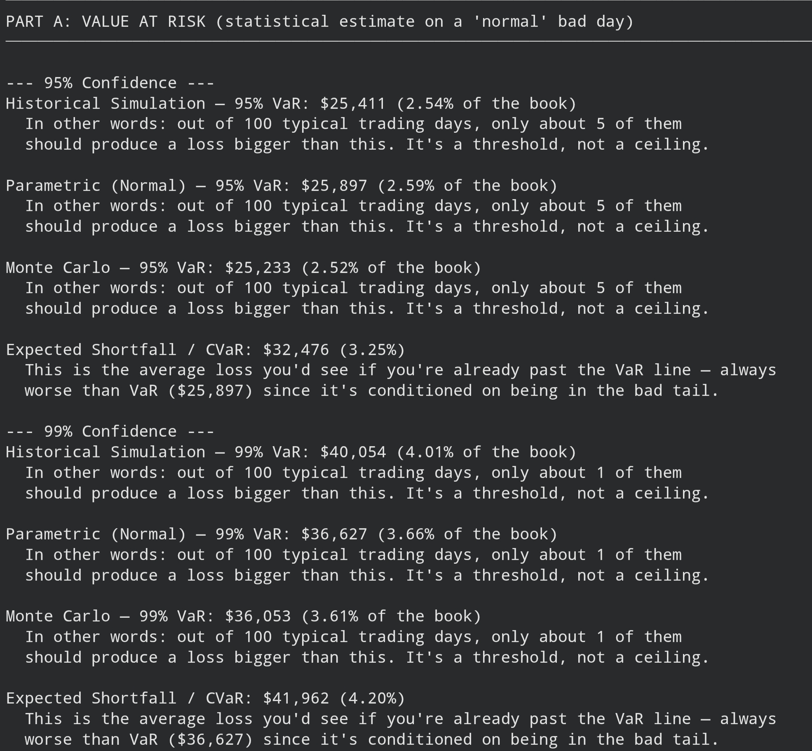
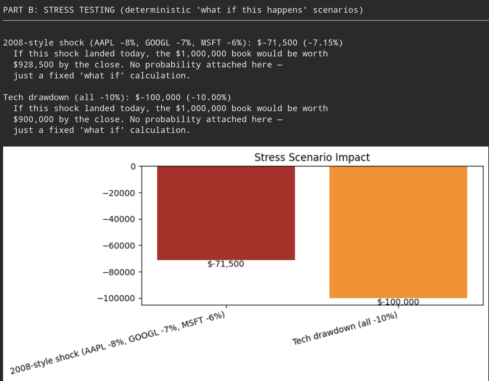

# Portfolio Risk Engine — VaR + Stress Testing

## What is this?

This is a small tool I built to answer one practical question: **"If I had $1,000,000
invested in Apple, Google, and Microsoft, how much could I realistically lose on a bad
day — and how bad could my worst days actually get?"**

There are two parts to the answer:

1. **Value at Risk (VaR)** — a statistical estimate of "normal" bad-day losses, calculated
   three different ways so I could cross-check the answer instead of trusting one method blindly.
2. **Stress Testing** — instead of statistics, I asked "what if a specific crisis hit today?"
   and calculated the exact dollar damage.

## How to run it
pip install -r requirements.txt
python main.py

Or in Google Colab: run each file cell in order (`data.py` → `risk.py` → `scenarios.py`
→ `explain.py` → `main.py`), then run `main.py`. To check the tests pass:
python test_risk_engine.py

## What's inside

| File | What it does |
|---|---|
| `data.py` | Pulls stock prices from Yahoo Finance and turns them into daily returns |
| `risk.py` | The three VaR methods (Historical, Parametric, Monte Carlo) plus Expected Shortfall |
| `scenarios.py` | Stress scenarios, a correlation-crisis simulation, and a backtest |
| `explain.py` | Turns raw numbers into plain-language explanations |
| `main.py` | Runs everything end-to-end and prints/plots the full report |
| `test_risk_engine.py` | Automated checks that prove the math behaves correctly on known inputs |

## What I actually found

Running this on ~4.5 years of real data (Jan 2022 – Jul 2026):

- **At 95% confidence, all three VaR methods agreed closely** — around $25,000-26,000
  a day. When three independent approaches land in the same place, that's a strong signal
  the underlying math and data are sound, not a coincidence.
- **At 99% confidence, the methods disagreed more** — Historical VaR came out to about
  $40,000, noticeably higher than Parametric/Monte Carlo (~$36,000-36,600). This wasn't
  a bug — it's the real market showing "fatter tails" than a clean bell-curve model expects.
  Extreme days happen more often in reality than a Normal distribution predicts.
- **Expected Shortfall was always meaningfully higher than VaR** (e.g. $41,962 vs $36,627
  at 99%) — exactly as it should be, since it measures the average loss *inside* the worst-case
  tail, not just where that tail begins.
- **A 2008-style shock (-8%/-7%/-6%) would cost about $71,500.** A flat 10% tech drawdown
  across all three stocks would cost exactly $100,000 — a useful gut-check that the math
  lines up with plain arithmetic.
- **Forcing correlations up to 0.85 (simulating a crisis where everything falls together)
  increased VaR by about 12.6%** at both confidence levels. This is the part I find most
  interesting: my portfolio's built-in diversification is worth roughly 12.6% of risk
  reduction — and that protection shrinks exactly when markets are most stressed.
- **I backtested the model against real history**, not just theory: rolling a 250-day
  VaR window forward and checking how often actual losses broke through it. Result: 43
  breaches out of 877 days, a 4.9% breach rate — almost exactly the 5% you'd expect from
  a well-calibrated 95% VaR model. That's the strongest evidence in this project that the
  approach actually works, not just that the formulas are typed in correctly.

## Why I built it this way

I split the code into small, single-purpose files instead of one long script, so each
piece — fetching data, calculating VaR, running scenarios — can be tested and understood
on its own. I also wrote automated tests using synthetic data (not live market data), so
the logic can be verified instantly without depending on an internet connection or the
market being open.

## What this model can't tell you (and I think that matters)

- It assumes the recent past is a decent guide to tomorrow — it isn't always.
- Two of the three VaR methods assume returns follow a clean bell curve. Real markets
  don't fully cooperate with that assumption, especially in crashes.
- VaR only tells you where a "bad day" threshold sits — it doesn't tell you how bad
  the very worst days could get. That's exactly why I added Expected Shortfall and
  stress testing alongside it, rather than relying on VaR by itself.
- Correlations between stocks aren't fixed — they can spike during real crises, which
  is what the correlation-spike scenario is designed to expose.

I think a risk report that quietly hides these limitations is more dangerous than one
that states them plainly — so I built this to show its own edges, not just its output.

## Results & Output

### 1. Price Performance & Correlation

I pulled ~4.5 years of daily data (Jan 2022 – Jul 2026, 1,128 trading days) for AAPL,
GOOGL, and MSFT. Looking at normalized performance, all three stocks moved through
the same broad cycles — a drawdown through 2022, recovery into 2024, and a stronger
run after that — but with real divergence in magnitude, especially GOOGL's later run-up.

The correlation matrix confirms this: pairwise correlations sit around 0.55-0.57.
That's moderate, not extreme — these three stocks share some common exposure (they're
all large-cap tech), but they don't move in lockstep. This matters directly for VaR,
because it's the reason the portfolio's risk is lower than simply adding up each
stock's individual risk — diversification is doing real work here, just not a huge amount.

### 2. Value at Risk — Three Methods, Cross-Checked

Rather than trust one VaR method blindly, I computed all three and used their agreement
(or disagreement) as a sanity check on the whole model.

| Method | 95% VaR | 99% VaR |
|---|---|---|
| Historical Simulation | $25,411 | $40,054 |
| Parametric (Normal) | $25,897 | $36,627 |
| Monte Carlo | $25,233 | $36,053 |
| Expected Shortfall (CVaR) | $32,476 | $41,962 |

**At 95% confidence, all three methods land within about $650 of each other** —
strong agreement, and a good sign the data and math are both sound.

**At 99% confidence, Historical VaR pulls noticeably higher** ($40,054) than
Parametric/Monte Carlo (~$36,000-36,600). This isn't an error — it's the real
market showing "fatter tails" than a bell-curve model expects. Parametric and Monte
Carlo both assume returns follow a Normal distribution, which smooths away how often
truly extreme days happen. Historical Simulation just reads directly off real past
days, so it picked up on an actual bad day that the Normal-distribution methods
under-predicted. This is one of the most important things this project surfaced —
proof, not just theory, that Normal-distribution risk models can understate tail risk.

**Expected Shortfall (CVaR) came out higher than VaR at every confidence level**,
exactly as it should — CVaR is the average loss *given* you're already past the
VaR line, so it's always a larger number than the threshold itself.

### 3. Stress Testing — What If a Specific Shock Hit Today?

VaR is a statistical estimate. Stress testing is different — it's a direct "if this
exact thing happens, here's the dollar cost," with no probability attached.

| Scenario | Shock | Portfolio Loss |
|---|---|---|
| 2008-style shock | AAPL -8%, GOOGL -7%, MSFT -6% | -$71,500 (-7.15%) |
| Tech drawdown | All three -10% | -$100,000 (-10.00%) |

The tech-drawdown number is a useful gut-check on its own — a flat 10% drop across
an entire $1,000,000 book should cost exactly $100,000, and it does, confirming the
underlying weighted-sum math is correct.

### 4. Correlation Spike — Diversification Breaking Down

This scenario keeps each stock's own volatility unchanged but forces the pairwise
correlation up to 0.85 — simulating a crisis where stocks that normally move somewhat
independently suddenly start falling together.

| Confidence | Normal VaR | Correlation-Spiked VaR | Increase |
|---|---|---|---|
| 95% | $25,897 | $29,161 | +12.6% |
| 99% | $36,627 | $41,242 | +12.6% |

The takeaway: roughly 12.6% of this portfolio's risk protection comes from the fact
that AAPL, GOOGL, and MSFT don't crash in perfect sync. In a real crisis, that
protection tends to shrink or disappear — which is exactly the point of running
this scenario rather than just trusting the "normal" correlation numbers.

### 5. Rolling VaR Backtest — Does the Model Actually Hold Up?

Instead of just trusting the VaR formula, I tested it: rolled a 250-day historical
VaR window forward through the data day by day, and checked how often the *next*
day's actual loss broke through the threshold predicted from *prior* days only
(no lookahead).

**Result: 43 breaches out of 877 testable days — a 4.90% breach rate.** A well-calibrated
95% VaR model should breach about 5% of the time, so this is close to ideal. It's the
strongest piece of evidence in the whole project that the model isn't just
mathematically correct on paper — it's actually reliable against nearly 3.5 years
of real market behavior.

### Automated Tests

To make sure the logic itself is correct (not just "looks right" on real data), I
wrote 6 unit tests using synthetic data, so they run instantly with no internet
dependency:

- 99% VaR is always greater than or equal to 95% VaR
- CVaR always exceeds VaR at the same confidence level
- Parametric and Monte Carlo VaR agree within 5% of each other
- A hand-calculable stress shock matches manual arithmetic exactly
- Forcing correlation upward never decreases VaR
- Weights that don't sum to 1 raise an error instead of silently producing wrong numbers

All 6 pass.
